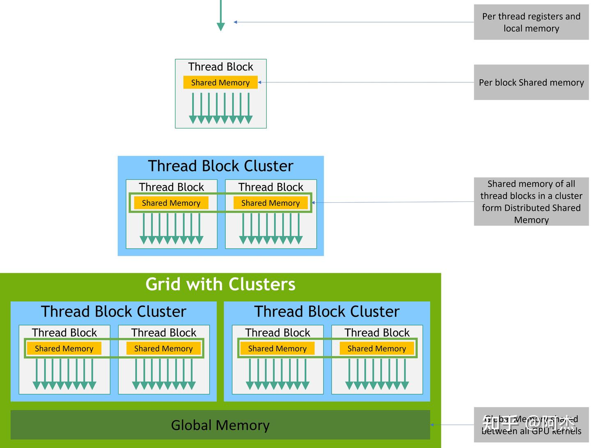

<center>
<h1>Cluster & 数据类型 & inline PTX</h1>
</center>

## Thread Block Cluster

> 📖 本部分内容参考了知乎专栏文章 [CUDA 编程之 Thread Block Cluster - 阿木木](https://zhuanlan.zhihu.com/p/708645371) 与 [H100 Course 第二讲：Clusters, Data types, inline PTX, State Spaces](https://cudacourseh100.github.io/H100-Course/slides/2.%20Clusters,%20Data%20types,%20inline%20PTX,%20State%20Spaces.pdf)。

### 为什么需要 Thread Block Cluster

长期以来，GPU 的线程模型都是三层结构，自底向上分别是 Thread、Thread Block 以及 Grid。其中 Grid 是最上层的结构，Grid 中所有的线程都可以访问 Global Memory 的内容。一个 Grid 由多个 Thread Block 组成，每个 Thread Block 有一块对应的 Shared Memory，同一个 Thread Block 中的所有线程可以通过 Shared Memory 交换数据。

由于片上数据访存快的原因，在 GPU 编程中，Kernel 的设计大多是以 Thread Block 这个粒度展开的。但一个 Thread Block 存在两个硬约束：它被分配到一个 SM 上运行、不能跨 SM；它的资源有上限——最多 1024 个线程、227KB Shared Memory（H800/H100）。这就带来了几个问题：

1. **单个 Thread Block 处理的数据规模有限。** 一个 Thread Block 能够调用的 Shared Memory 仅有 227KB（对比之下，H800 的 Global Memory 有 80GB）。这使得单个 Thread Block 为了使用 Shared Memory 加速性能时，只能处理一个数据规模较小的子任务。一旦任务规模变大，Shared Memory 不够用，Thread Block 就只能访问延迟高的 Global Memory 了。
2. **大粒度的子任务只能压在单个 SM 上。** 假如每个 Thread Block 处理较大规模的数据、计算，一个 Block 就要在单个 SM 上运行很久，Kernel 能发射的 Block 总数也随之变少，可能导致某些 SM 处于空闲状态。而为了喂满所有 SM 把子任务切小，又会回到上面 Shared Memory 不够用的问题。
3. **Thread Block 之间无法高效协作。** Grid 不保证各个 Block 同时驻留在 SM 上，因此跨 Block 交换数据只能绕道延迟高的 Global Memory，也几乎没有低开销的跨 Block 同步手段。

解决这些问题最直接的方式，就是在 Thread Block 和 Grid 之间提供一层更大粒度的线程组，并由硬件保证它们被共同调度、可以互相访问 Shared Memory——这就是 Thread Block Cluster。

### Thread Block Cluster 的基本概念

一个 Thread Block Cluster 由若干个 Thread Block 构成。Cluster 可以是一维、二维或三维的（例如 `__cluster_dims__(2, 2, 1)`），各维度之积就是 Block 的数量，称为 Cluster Size。CUDA 保证的可移植上限是 8；H100 硬件上最多支持 16，但超过 8 需要显式开启非可移植属性（`cudaFuncAttributeNonPortableClusterSizeAllowed`）。16 能成立，是因为 H100 的一个 GPC 内有足够多的 SM 来容纳整个 Cluster。



这里有一个关键前提：硬件保证同一个 Cluster 的所有 Block 会被共同调度到**同一个 GPC 内**的不同 SM 上，并且在 Cluster 的整个生命周期内同时驻留。正因为有这个保证，跨 SM 的 Shared Memory 访问和 Cluster 级的同步才是安全、有意义的。

同一个 Cluster 内的所有线程可以访问其他 Block 的 Shared Memory，这些 Shared Memory 合起来称为 Distributed Shared Memory（DSMEM），其地址空间是 Cluster 内所有 Block 的 Shared Memory 的并集。DSMEM 并不是一种新增的新型存储器，而是已有 Shared Memory 的"集合"。

需要注意的是，要区分"可寻址"和"可分配"：DSMEM 让线程能访问到 Cluster 内总计最大 Cluster Size × 227KB 的空间，但每个 Block 仍然只能在自己所在的 SM 上分配最多 227KB。也就是说，DSMEM 并没有解除单个 Block 的 Shared Memory 上限——它不是把 Cluster 内所有 Shared Memory 汇聚成一个大的 Shared Memory，而是让你能用上其他 SM 的 Shared Memory。

实现上，DSMEM 不是通过 L1 Cache（每个 SM 独立拥有，其他 SM 无法访问），也不是通过 L2 Cache（每个 SM 都可以访问），而是通过 Hopper 架构在 GPC 内新增的一层 SM to SM Network 实现的。代价是：访问远端 Block 的 Shared Memory 延迟要高于访问本地的 Shared Memory，所以 DSMEM 并不是"免费的更大 Shared Memory"，数据布局时仍应让高频访问尽量落在本地。

在软件层，CUDA 为 DSMEM 提供了访问接口（如 `cluster.map_shared_rank`）以及整个 Cluster 的同步接口（如 `cluster.sync()`）。借助 Thread Block Cluster，开发者可以将一个子任务的数据规模 Scale 到 Cluster Size 倍，同时占用多个 SM 的算力，大大增加了子任务的处理能力以及 SM 利用率。同时编译器或类似工具不会自动创建 Thread Block Cluster，因此需要程序员显式创建 Cluster 并设置大小。

TMA 与 Cluster 配合还有两个常用的能力：

- **异步拷贝到远端 SMEM**：TMA 异步拷贝的目的地可以是 Cluster 内远端 Block 的 Shared Memory，配合 SM to SM Network 可以实现跨 SM 的生产者-消费者数据流。
- **Multicast**：由 Cluster 内的单个线程发起一次 TMA multicast 操作，同一份数据从 Global Memory 读取后，同时写入 Cluster 内多个 Block 的 Shared Memory（每个 Block 写入各自 SMEM 中相同的偏移位置）。这样既避免了每个 Block 各自重复读取同一份数据（典型场景是 GEMM 中所有 Block 共用的权重 tile），也无需线程显式地跨 SM 读写 DSMEM 来转发数据——后者会挤占 SM to SM Network 并带来额外的同步开销。

### Thread Block Cluster 编程

我们可以在算子定义时来规定 Cluster 的维度，例如：

```cpp
__global__ void __cluster_dims__(2, 2, 1) cluster_kernel(float* input, float* output)
```

这样定义之后，就可以正常地 launch 这个 kernel 了。只是需要注意的是，grid 的维度必须是 cluster 维度的整数倍。
